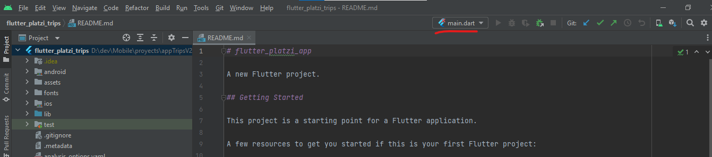

# flutter_platzi_app

A new Flutter project.

## Getting Started

This project is a starting point for a Flutter application.

A few resources to get you started if this is your first Flutter project:

- [Lab: Write your first Flutter app](https://docs.flutter.dev/get-started/codelab)
- [Cookbook: Useful Flutter samples](https://docs.flutter.dev/cookbook)

For help getting started with Flutter development, view the
[online documentation](https://docs.flutter.dev/), which offers tutorials,
samples, guidance on mobile development, and a full API reference.

## Initialize project:



```bash
flutter pub get
flutter create . 
flutter run
```

### Command "flutter pub get"
This command ensures that your project has the correct and updated dependencies as defined in your pubspec.yaml file. It is important to run flutter pub get after adding or modifying dependencies in your pubspec.yaml file to ensure that the correct versions of the packages are downloaded and used in your project.

### Command "flutter create ."
When executing this command, Flutter will generate the necessary files and directories for a basic Flutter project in the current directory."

### Command "flutter upgrade"
If you want to update the framework installation and its dependencies to the latest available version.

### Command "flutter run"
It is used in Flutter to run the Flutter application on a device or emulator. When you run 'flutter run,' Flutter compiles your source code, starts the application, and deploys it on the selected device or emulator.

```bash
flutter upgrade
flutter create . 
flutter run
```